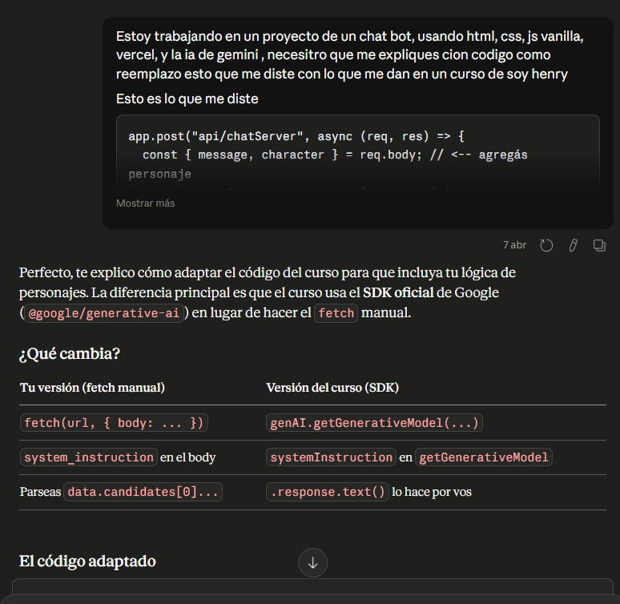

# 🚗 Proyecto M3 Henry - Chat Rápidos y Furiosos


---

## 📌 Descripción

Aplicación web tipo **chatbot interactivo** inspirada en el universo de *Rápidos y Furiosos*, donde los usuarios pueden comunicarse con distintos personajes de la saga.

Cada personaje tiene su propia personalidad, permitiendo simular conversaciones dinámicas dentro del contexto de la franquicia.

> 💡 Proyecto desarrollado como parte del M3 de Soy Henry.

---

## 👨‍💻 Autor

**Maximo Galvez Landers**

---

## 🌐 Deploy

- 🔗 Repositorio:  
  https://github.com/MGalvezLanders/ProyectoM3_MaximoGalvezLanders.git  

- 🚀 Aplicación:  
  https://proyecto-m3-maximo-galvez-landers-c.vercel.app/  

---

## 🛠️ Tecnologías utilizadas

### 🎨 Frontend
- HTML5  
- CSS3  
- JavaScript (Vanilla)  

### ⚙️ Backend
- Node.js  

### 🧪 Testing
- Vitest  
- Supertest  

### 🤖 IA 
- Gemini-2.5-flash

### 🚀 Otros
- Vercel (deploy)  
- Vite (entorno de desarrollo)  

---

## 📁 Estructura del proyecto

```
/api
  /apiUtils
  /mock
    charactersRole.js
    chatServer.js

/public
  /img
  /imgg

/src
  /css
  /navigation
  /routes
  /utils
  /views
  index.html
  script.js
  style.css

/tests

.env
.env.example
.gitignore
package.json
vite.config.js
vitest.config.js
vercel.json
```

---

## 📥 Clonar el repositorio

```bash
git clone https://github.com/MGalvezLanders/ProyectoM3_MaximoGalvezLanders.git
cd ProyectoM3_MaximoGalvezLanders
```

---

## ▶️ Ejecutar el proyecto localmente

1. Instalar dependencias:

```bash
npm install
```

2. Ejecutar el entorno de desarrollo:

```bash
npm run dev
```

3. Abrir en el navegador:

```
http://localhost:5173
```

---

## 🧪 Testear la aplicación

Para correr los tests:

```bash
npm test
```

✔️ Tests realizados con **Vitest** y **Supertest**  
✔️ Validación de endpoints y lógica del backend  

---

## 🌐 Uso de la aplicación

La aplicación cuenta con una navegación simple:

- 🏠 **Home**
- 💬 **Chat**
- ℹ️ **About**

### 🔄 Flujo de uso:

1. Ir a la sección **Chat**
2. Seleccionar uno de los personajes disponibles
3. Iniciar conversación
4. Recibir respuestas según la personalidad del personaje

Actualmente hay **4 personajes disponibles**.

---

## 🤖 Uso de Inteligencia Artificial

Durante el desarrollo se utilizaron herramientas de IA para mejorar la productividad, resolver errores y documentar el proyecto.

### 🧠 Herramientas utilizadas:

- ChatGPT → documentación y consultas generales  
- Claude → lógica y debugging  
- GitHub Copilot → autocompletado de código  

---

### 💬 Ejemplo de prompt:

```
Crear un endpoint en Node.js que simule respuestas de personajes con diferentes personalidades
```

### 📤 Resultado:

- Generación de estructura del servidor  
- Creación de endpoints  
- Lógica para respuestas dinámicas según personaje  

---

## Evidencia de uso de IA

### 📌 Error de módulos en JavaScript

### Prompt
- A que se refiere este error script.js:1 Uncaught SyntaxError: Cannot use import statement outside a module (at script.js:1:1)


---

### 💬 Flujo de implementación del chatbot


---

### 🤖 Integración con IA (explicación técnica)



## 🚀 Características principales

- Interfaz simple y clara  
- Navegación tipo SPA  
- Chat interactivo con personajes  
- Separación frontend / backend  
- Testing implementado  

---

## 🔧 Mejoras futuras
 
- [ ] Sistema de usuarios  
- [ ] Persistencia de chats  
- [ ] Mejoras de UI/UX  
- [ ] Agregar más personajes  